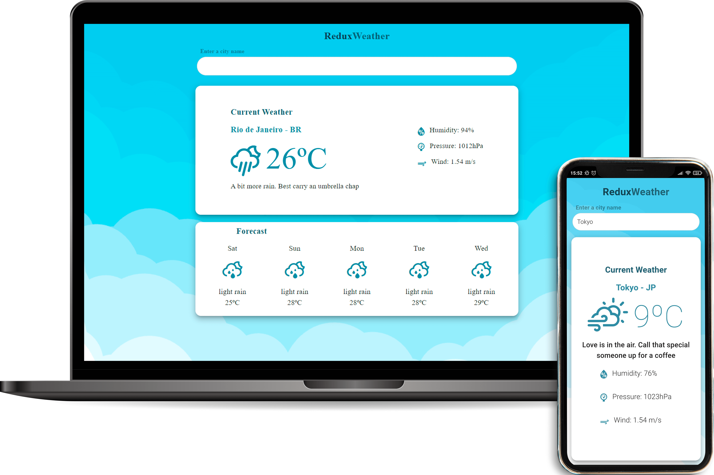

<p align="center">
  <a href="#-site">Site</a>&nbsp;&nbsp;&nbsp;|&nbsp;&nbsp;&nbsp;
  <a href="#-technology">Technology</a>&nbsp;&nbsp;&nbsp;|&nbsp;&nbsp;&nbsp;
  <a href="#-project">Project</a>&nbsp;&nbsp;&nbsp;|&nbsp;&nbsp;&nbsp;
  <a href="#-started">Getting started</a>&nbsp;&nbsp;&nbsp;|&nbsp;&nbsp;&nbsp;

</p>

<br>

<p align="center">
  
</p>

## ⛅ Site

In the link below you will find the complete responsive website.

-   [Redux Weather](https://weather-app.lucasgaudio.vercel.app/)

## 🚀 Technology

This project was developed with the following technologies:

-   [React](https://reactjs.org)
-   [Redux](https://redux.js.org/)
-   [Material-UI](https://material-ui.com/)

## 💻 Project

Redux Weather is a React weather app with Redux that displays weather information from the OpenWeatherMap API.

## 🏁 Getting started

-   Sign up over at [openweathermap.org](https://openweathermap.org/appid) to get an API key.
-   Fork the project and clone it locally.
-   Create a file at the root of the project called `.env` with the following contents:

```sh
REACT_APP_OPENWEATHERMAP_KEY = The API key you obtained from openweathermap.org
```
